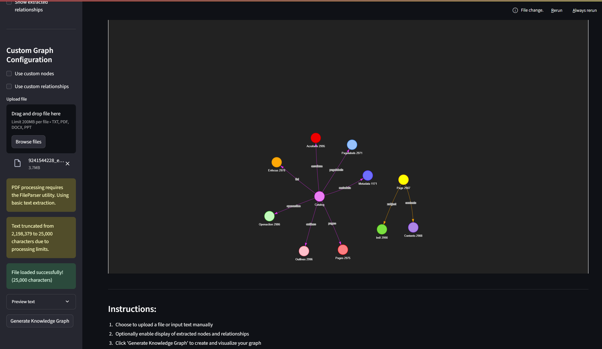

# Knowledge Graph Generator

A powerful Streamlit application that transforms unstructured text into interactive knowledge graphs using advanced language models and graph visualization techniques.

## 🌟 Features

### Core Functionality
- **Text-to-Graph Conversion**: Transform any text into a structured knowledge graph
- **Multiple Input Methods**: Support for file uploads (TXT, PDF, DOCX, PPT) and direct text input
- **Interactive Visualization**: Dynamic, zoomable graphs with physics-based layouts
- **Custom Entity Types**: Define your own node types and relationship categories
- **Data Export**: Download extracted nodes and relationships as CSV files
- **Real-time Statistics**: View graph metrics including node count, relationships, and text length

### Advanced Features
- **Async Processing**: Efficient handling of large texts with non-blocking operations
- **Error Handling**: Robust error management with user-friendly feedback
- **Character Limits**: Smart truncation for optimal performance (25,000 character limit)
- **Graph Customization**: Configurable physics settings and visual themes
- **Preview Functionality**: Text preview before processing

## 🚀 Quick Start

### Prerequisites
- Python 3.8+
- Google Generative AI API key
- Required Python packages (see installation)

### Installation

1. **Clone the repository**
```bash
git clone <repository-url>
cd knowledge-graph-generator
```

2. **Create virtual environment**
```bash
python -m venv venv
source venv/bin/activate  # On Windows: venv\Scripts\activate
```

3. **Install dependencies**
```bash
pip install -r requirements.txt
```

4. **Set up environment variables**
Create a `.env` file in the root directory:
```env
GOOGLE_API_KEY=your_google_api_key_here
OPENAI_API_KEY=your_openai_api_key_here  # Optional
CHAR_LIMIT=25000                         # I chose 25000 for low LLM tokens consumption 
```

5. **Run the application**
```bash
streamlit run app.py
```

## 📖 Usage Guide

### Basic Usage
1. **Choose Input Method**: Select between file upload or direct text input
2. **Configure Options**: Optionally enable node/relationship display and custom configurations
3. **Input Your Data**: Upload a file or paste text (max 25,000 characters)
4. **Generate Graph**: Click "Generate Knowledge Graph" to process
5. **Explore Results**: Interact with the generated visualization

### Custom Configurations
- **Custom Nodes**: Define specific entity types (e.g., "Person, Organization, Location")
- **Custom Relationships**: Specify relationship types (e.g., "WORKS_FOR, LOCATED_IN, MARRIED_TO")
- **Display Options**: Choose to show extracted data tables and download options

### Supported File Types
- **TXT**: Plain text files
- **PDF**: Portable Document Format (basic extraction)
- **DOCX**: Microsoft Word documents (requires additional setup)
- **PPT**: PowerPoint presentations (requires additional setup)

## 🏗️ Architecture

### Core Components
```
├── app.py              # Main Streamlit application
├── main.py             # Core graph processing logic
├── .env                # Environment variables
└── knowledge_graph.html # Generated graph output
```

### Key Technologies
- **Streamlit**: Web application framework
- **LangChain**: LLM orchestration and graph transformation
- **Google Generative AI**: Entity and relationship extraction
- **PyVis**: Interactive graph visualization
- **Pandas**: Data manipulation and export

### Processing Pipeline
1. **Text Input** → Document parsing and preprocessing
2. **LLM Processing** → Entity and relationship extraction
3. **Graph Creation** → Node and edge generation
4. **Visualization** → Interactive graph rendering
5. **Export** → Data download and sharing

## 🔧 Configuration Options

### Environment Variables
```env
GOOGLE_API_KEY=your_key           # Required: Google AI API key
OPENAI_API_KEY=your_key           # Optional: OpenAI API key
CHAR_LIMIT=25000                  # Optional: Character processing limit
```

### Graph Visualization Settings
- **Physics Engine**: ForceAtlas2 for natural clustering
- **Node Styling**: Color-coded by entity type
- **Edge Labels**: Relationship type display
- **Interactive Controls**: Zoom, pan, filter capabilities

## 🚀 Next Steps & Future Improvements

### 1. RAG Integration (Retrieval-Augmented Generation)

#### Implementation Plan
```python
# Example RAG Integration
class RAGKnowledgeGraph:
    def __init__(self, vector_store, llm):
        self.vector_store = vector_store
        self.llm = llm
        self.retriever = vector_store.as_retriever()
    
    async def enhanced_extraction(self, query, context_docs):
        # Retrieve relevant context
        relevant_docs = await self.retriever.aretrieve(query)
        # Enhance extraction with context
        enhanced_prompt = self.create_context_prompt(query, relevant_docs)
        return await self.llm.ainvoke(enhanced_prompt)
```

#### Benefits
- **Contextual Understanding**: Leverage existing knowledge for better entity recognition
- **Domain-Specific Extraction**: Use domain corpora for specialized knowledge graphs
- **Historical Context**: Maintain knowledge continuity across documents
- **Improved Accuracy**: Reduce hallucinations with factual grounding

### 2. GraphRAG Implementation

#### Advanced Architecture
```python
# GraphRAG Integration Example
class GraphRAGPipeline:
    def __init__(self):
        self.knowledge_graph = Neo4jGraph()
        self.vector_index = VectorStoreIndex()
        self.graph_index = PropertyGraphIndex()
    
    async def query_with_context(self, question):
        # Multi-hop reasoning through graph
        graph_context = await self.graph_traversal(question)
        # Vector similarity for relevant chunks
        vector_context = await self.vector_retrieval(question)
        # Combine contexts for comprehensive answer
        return await self.synthesize_response(question, graph_context, vector_context)
```

#### Features to Implement
- **Multi-hop Reasoning**: Complex queries across multiple relationships
- **Community Detection**: Identify clusters and summarize communities
- **Temporal Graphs**: Track entity relationships over time
- **Graph Embeddings**: Vector representations of graph structures

### 3. Enhanced Database Integration

#### Neo4j Integration
```python
from neo4j import GraphDatabase

class Neo4jConnector:
    def __init__(self, uri, user, password):
        self.driver = GraphDatabase.driver(uri, auth=(user, password))
    
    def store_graph(self, nodes, relationships):
        # Persistent graph storage
        # CRUD operations
        # Graph analytics
```

#### Vector Database Support
- **ChromaDB**: Local vector storage
- **Pinecone**: Cloud-based vector database
- **Weaviate**: Open-source vector database
- **Qdrant**: High-performance vector search

---
#### Screenshot: 

